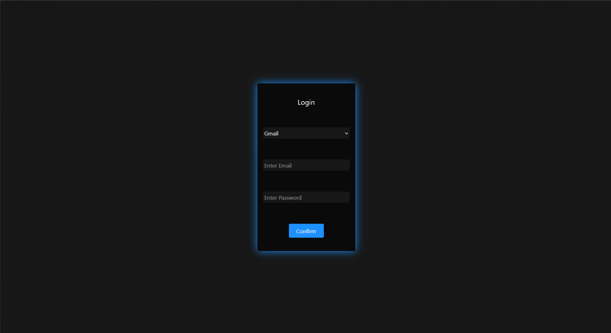
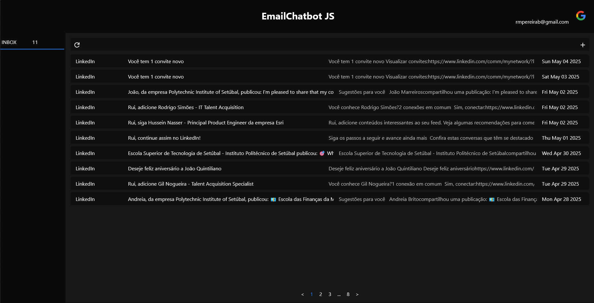
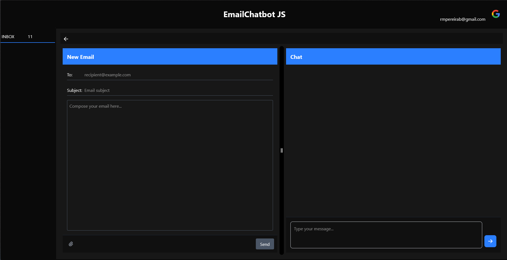
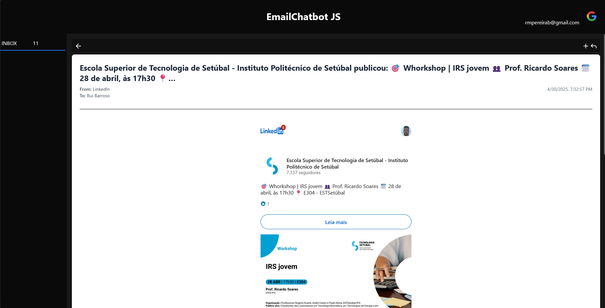
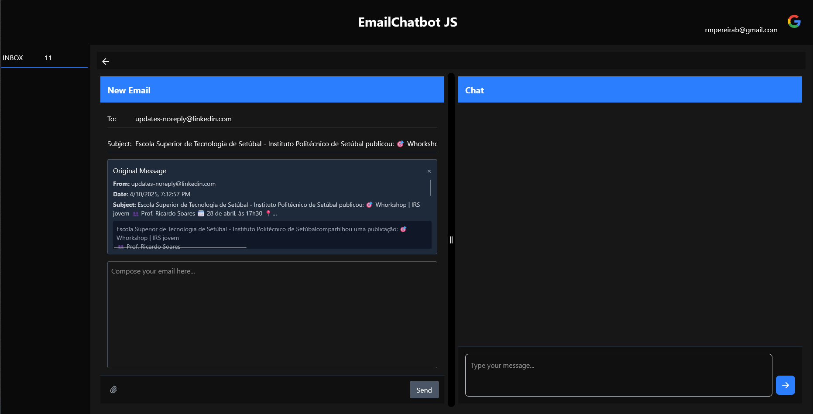
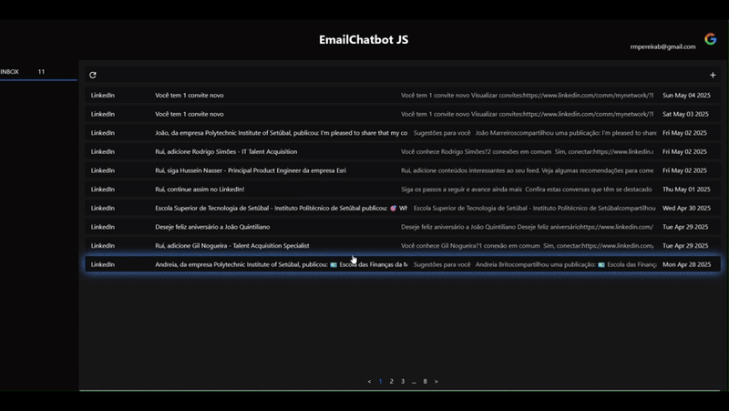

# Email Chatbot

## 📸 Screenshots

### 🔐 Login Screen  


### 📥 Inbox - Viewing Emails  


### 📝 Composing a New Email  


### 📖 Reading an Email  


### 💬 Responding to an Email with Context  


### 🎞️ Application Demo  


## Introduction

The Email Chatbot is a full-stack application that helps users manage their email communications more efficiently. It combines email functionality with AI-powered responses, allowing users to read, respond to, and compose emails through an intuitive interface. The system features paginated email loading, contextual email responses, and a customizable layout.

## Features

- **Email Management**:
  - Read mailboxes and individual emails
  - Send new emails
  - Respond to emails with context awareness
- **AI Integration**:
  - GroqAI-powered email responses
  - Smart chat functionality
- **User Experience**:
  - Stack-based navigation system
  - Paginated email loading (10 emails per page)
  - Draggable panel for adjusting chat/email composition areas
  - Popup notifications for user feedback
- **Technical**:
  - JWT authentication
  - Dockerized deployment for both frontend and backend
  - RESTful API design
  - External API (GroqAi, IMAP, SMTP)

## How to Use

### Installation

#### 1. Prerequisites

- Docker and Docker Compose installed  
- GroqAI API key  
- A Gmail account with an App password  

#### 2. Setup

**Clone the repository:**
```bash
git clone https://github.com/ruimbarroso/EmailChatbotJS.git
cd EmailChatbotJS
```

**Create environment files:**

```bash
cp .env.example .env
```

**Edit the `.env` file with your credentials.**

**Run with Docker:**

```bash
docker-compose up --build
```

---

### Running the Application

* **Frontend:** [http://localhost:3000](http://localhost:3000)
* **Backend API:** [http://localhost:8080](http://localhost:8080)

---

### Uninstallation

To completely remove the application:

```bash
docker-compose down -v
rm -rf email-chatbot
```

## Technical Details

### Backend (Go Web API)

**Technologies:**

- Go programming language  
- IMAP/SMTP for email communication  
- JWT for authentication  
- GroqAI integration  

**API Endpoints:**

**Authentication**
- `POST /auth/login` – User login  
- `POST /auth/logout` – User logout  
- `GET /auth/me` – Get current user info  

**AI Functionality**
- `POST /chat/` – Process chat requests  

**Email Management**
- `GET /email/` – Get paginated emails  
- `POST /email/` – Send new email  

---

### Frontend (React with TypeScript)

**Technologies:**

- Vite build tool  
- React with TypeScript  
- Bootstrap for styling  
- State management with React hooks  

**Key Components:**

- Stack-based navigation system  
- Paginated email loading  
- Draggable layout panels  
- Context-aware email composition  

---

### Observations

This project implements several notable features:

- Stack navigation system to maintain navigation order  
- Popups for user feedback  
- Email pagination (10 emails per page)  
- Draggable panel for adjusting chatbot and email writer areas  
- Email context shown when responding to messages  
- Dockerized deployment for both frontend and backend  

---

## Contact

For questions or support, contact [rmpereirab@gmail.com](mailto:rmpereirab@gmail.com)

---

### License

This project is licensed under the **MIT License**.